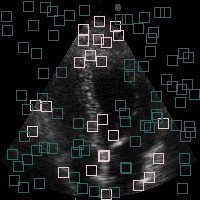

# Zaraban
Zaraban is a biomedical tools that provide high-level APIs for analyzing echocardiograms. 
This python package consists of various methods including:
- Seckle detection using machine learning
- Speckle Tracking Echocardiography (STE)
- Movement visualization and saving
- ...

## Installation
Download and extract the file in the site-packages folder of Python. 
After downloading the package, you should install all packages in requirements.txt by the command below:

    pip install -r requirements.txt


## How to use the package!

Here are some examples for reading, tracking and saving frames with Zaraban.  
But before that it is necessary to import some modules as follows:

    from zaraban import tools
    from zaraban.STE import track
    from zaraban.STE import speckle


### Read Frames

    frames = tools.read_frames(path, size=(200, 200), pattern="im ({}).bmp")
    
path: path of the parent folder of frames.  
size (optional): desire output frame size. Default=(200, 200).  
pattern (optional): filename pattern. If it is not determined, files will be read alphabetically.  


### Feature Extraction and Speckle Modeling
In order to train the model for speckle detection, you first need to extract
 some patches and use their features as the train data.  
 
UnSupervised:

    points, patches, features = speckle.random_point_patch_feature(frames, kernel_radius, amount)
    speckle_model = speckle.Speckle(method='unsupervised')
    speckle_model.fit(speckle.flat(features))


Supervised:
    
    points, patches, features, labels = speckle.train_test_feature_select(frames, kernel_radius, amount)
    speckle_model = speckle.Speckle(method='supervised')
    speckle_model.fit(speckle.flat(features), speckle.flat(labels))

*amount: number of points per each frame


### Speckle detection using the trained model

Since features are a three-dimensioanl array, you might want to use features related to a specific frame as shown below:
    
    test_labels = speckle_model.predict(features[:, :, 0]) 

Let’s separate speckle by a rectangle around it:
    
    speckles_image = speckle.overlay_speckle_box(points[:, :, 0], test_labels, frames[0], kernel_width)

and then save the output image:
    
    import cv2
    cv2.imwrite('speckles_image.png', speckles_image)

The saved image would be like this:





### Tracking and Visualization
There are two types of tracking method: Eulerian vs Lagrangian.   
1) If you want to track some specific speckles (Lagrangian), use the code below:
    
    ```
    markers = speckle.pick_point(frame, amount)
    (vectx, vecty) = track.track_points_sequential(frames, markers, WS=kernel_radius, SS=search_radius, model=speckle_model, show_message=True)
    
    plt.imshow(frames[0])
    plt.plot(vectx, vecty)
    ```
    
*amount: number of points per each frame  

2) If you want to detect speckles' motion between two consequent frames (Eulerian), use the following:

    ```
    (vectx, vecty) = track.track_fixed_sequence(frames, WS=kernel_radius, SS=search_radius, model=speckle_model, show_message=True) 
    vrgb = tools.convert2map(vectx, search_radius)
    tools.save_as_video('output.avi', vrgb, overlay=True, source=frames)
    ```


